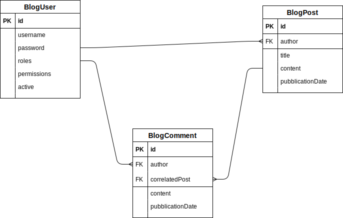

<h1> MicroBlog </h1>
 
 
 

 
 
 
## Start the application
Thanks to SpringBoot you will only have to download, build and run the project.
 
The database used is an in memory h2:
 - name: microblogdb
 - username: sa
 - password: <there isn't>
 
During the startup some mockup data are uploaded.
 
As specified in the application properties the default port used is **8081**.
 
Now (2020/05/10) the `dev-jwt` branch contains complete management of registration and login (server and client side) and logout (client side), also in this version the URIs have changed:
 - base path: `/microblog/v2`
 - login & registration: `/microblog/v2/login` & `/microblog/v2/registration`
 - h2 console: `/microblog/v2/h2`
 - swagger: `/microblog/v2/swagger-ui.html`
 - API: `/microblog/v2/api/**`
 
## Branch name format
```master``` main branch, only merge is allowed.

```dev``` main developing branch, only merge is allowed.

```dev-[feature]``` created from ```dev```, to develop feature, then merge into ```dev``` (ex.: ```dev-helloworld```).

```docs``` main documentaions branch, only merge is allowed.

```docs-[document]``` created from ```docs```, to write a specific document, then merge into ```docs``` (ex.: ```docs-visionstatement```).

## Swagger
To see information about API organized by Swagger:

```http://localhost:8081/microblog/v2/api/swagger-ui.html```

 ## Overview

 MicroBlog project implements a basic blog based on REST-microservices.
 
 A simple web interface allows users to create and comment posts.
 The application is developed with SpringBoot.

 ## Crow diagram
 
